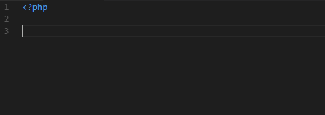

# PHPStorm PHP Live Templates for VSCode

This extension aims to provide the PHP Live Templates that come by default in new PHPStorm installations for Visual Studio Code.

## Usage

Type part of a snippet, press <kbd>Enter</kbd> (or <kbd>Tab</kbd> if you have `editor.tabCompletion` set to `true`) and the template will be placed right there for you.

## Snippets

| Snippet | Purpose                                              |
|---------|------------------------------------------------------|
| `eco`   | `echo` statement.                                    |
| `fore`  | `foreach(iterable_expr as $value) {...}`             |
| `forek` | `foreach(iterable_expr as $key => $value) {...}`     |
| `inc`   | `include` statement                                  |
| `inco`  | `include_once` statement                             |
| `prif`  | `private function`                                   |
| `prisf` | `private static function`                            |
| `prof`  | `protected function`                                 |
| `prosf` | `protected static function`                          |
| `pubf`  | `public function`                                    |
| `pubsf` | `public static function`                             |
| `rqr`   | `require` statement                                  |
| `rqro`  | `require_once` statement                             |
| `thr`   | `throw new` (by default, an `\Exception`)            |

---

**Happy coding!**

## License

[MIT License](./LICENSE.md)
