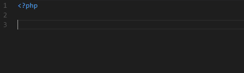

# PHPStorm PHP Live Templates for VSCode

This extension aims to provide the PHP Live Templates that come by default in new PHPStorm installations for Visual Studio Code.

## Usage

Type part of a snippet, press <kbd>Enter</kbd> (or <kbd>Tab</kbd> if you have `editor.tabCompletion` set to `true`) and the template will be placed right there for you.

## Snippets

| Snippet | Purpose                                              |
|---------|------------------------------------------------------|
| `eco`   | Echoes a double quoted string.                       |
| `fore`  | Iterates trough an array's `values`.                 |
| `forek` | Iterates trough an array's `keys => values`.         |
| `inc`   | Includes a file.                                     |
| `inco`  | Includes a file once.                                |
| `prif`  | Creates a `private function`.                        |
| `prisf` | Creates a `private static function`.                 |
| `prof`  | Creates a `protected function`.                      |
| `prosf` | Creates a `protected static function`.               |
| `pubf`  | Creates a `public function`.                         |
| `pubsf` | Creates a `public static function`.                  |
| `rqr`   | Requires a file.                                     |
| `rqro`  | Requires a file once.                                |
| `thr`   | Throws `new` something (by default, an `Exception`). |

## Known Issues

-   You may face a problem with autocompletion in some snippets, specially the ones that generate a function. When typing the function name, the `quickSuggestion` box may show up and you'll end up adding another snippet, instead of jumping to the parameters.

    See:

    

 This is a [known VSCode issue](https://github.com/Microsoft/vscode/issues/45716) and [this answer on StackOverflow](https://stackoverflow.com/a/43632288/4802649) offers a fix.

---

**Happy coding!**

## License

[MIT License](./LICENSE.md)
